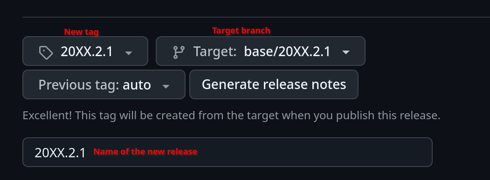
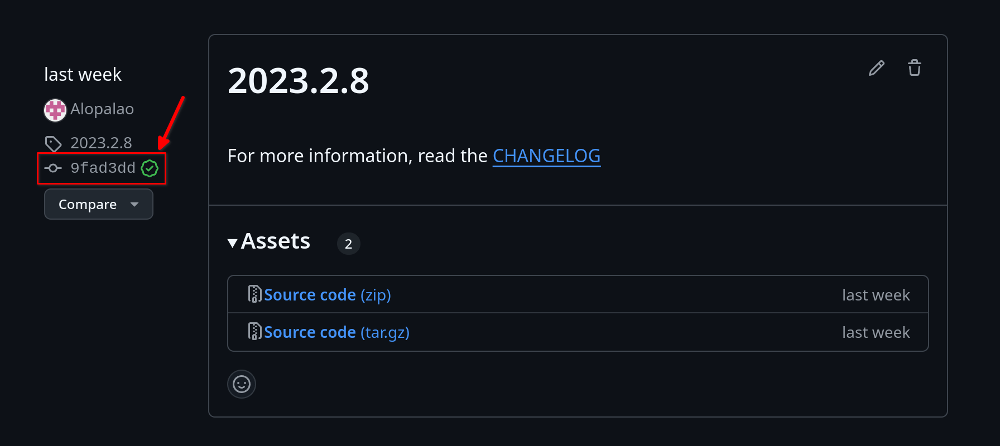

# How to open a PR (pull request)

## Prerequisites

- If you don't have a [GitHub](https://www.github.com) account, you'll need to create one
- If haven't contributed to Kytos-ng before, you'll need to <a href="https://docs.google.com/forms/d/1N-Cuq4L904j7fbxjJMpNY1s4JJMLAifq21Uwi7NwMKY">digitally sign</a> the <a href="../license/cla.html">CLA</a>
- Make sure that there's an existing aligned issue that will be linked in the PR

## General guidelines

- Contributions are more than welcome
- Small PRs are encouraged instead of large ones
- Breaking changes, architectural or significant changes that can impact Kytos-ng ecosystem should be discussed and aligned first with core members
- The branch name typically follows this pattern `[feature|fix|hotfix|doc|release|misc]/<name>`

## Submitting a PR

### PR checklist:

- Make sure linters and unit tests are passing with `tox`
- Summarize the PR title and add a tag `[feature|fix|hotfix|doc|release|misc]: <title>` accordingly
- Optionally, depending on the impact of your change, it might be helpful to also run [kytos-end-to-end-tests](https://github.com/amlight/kytos-end-to-end-tests) and include a summary of the results in a `### End-to-end Tests` subsection.

The following template is encouraged to be used:

```
Closes #issue_number

### Summary

See updated changelog file and/or add any other summarized helpful information for reviewers

### Local Tests

### End-to-End Tests
```

- Closes `#<issue_number` is for automatically closing the issue that this PR addresses
- `### Summary` will typically be `See updated changelog file` or also include additional helpful information for reviewers
- `### Local Tests` subsection is for documenting and explaining how you've validated and explored your change locally with `kytosd` in addition to shipping unit tests. Make sure to also check that there aren't errors on `kytosd` console or in the logs.
- `### End-to-end Tests` subsection is optional depending on the impact of the change

That's it. Once your PR is submitted make sure to keep an eye on your PR notifications for any follow ups, once it's approved, a core team member will merge it.

Thanks for contributing to Kytos-ng.

## Creating a Backport

Backports are necessary to keep old versions updated. When it is agreed to apply changes to released deployments, it is done for two main reasons:
- Bugs found: If a bug is found in an older deployment, it is necessary to address issues like this so as not to interrupt production scenarios.
- New required features: Exceptionally, in certain cases, some features can be desired to be in older versions so it is easier to interact with Kytos. Otherwise, it is recommended to upgrade to a newer version.

### How to create a backport and a new tagged version

- Find the latest version, e.g. `20XX.2.0`, then checkout that tag `20XX.2.0`.
- Create and push a new base branch incrementing the patch version `base/20XX.2.1` (only a core dev or maintainer can push a branch upstream; if such titles are needed, do not hesitate to request them).
- Create another branch `release/20XX.2.1` from `base/20XX.2.1`.
- Make the necessary changes on `release/20XX.2.1`, this could be done with `git cherry-pick <commit>` to pick the commits being backported. The only exception not to cherry-pick is when the original commit has extra unwanted code, in that case, only copy the desired parts.
- Create a pull request (PR) and target the branch `base/20XX.2.1`. New changes will be first in `release/20XX.2.1` and will get merged to `base/20XX.2.1`.
- After the PR is closed, make sure to delete `release/20XX.2.1` branch (most kytos-ng org repos will auto delete it).
- Draft a new release with the name as `20XX.2.1`, choose the tag `20XX.2.1` and target the branch `base/20XX.2.1` from this example.

<div align="center">
  <a href="assets/tag_example.png"></a>
</div>

- Double check if the new lease is targeting the correct branch. To do so, go to the Github release page, open the newly created release, and open the commit. Verify that the last PR was made on the PR which should target `base/20XX.2.1`. For example, from version `2023.2.8` this is the [commit](https://github.com/kytos-ng/mef_eline/commit/9fad3dd2d5c776b849d3d87cd9bc261174d92add) that can be accessed from the release page (picture from released version).

<div align="center">
  <a href="assets/version_example.png"></a>
</div>

- Send a notification about the new release on the Slack channel.

### Final observations.

PR created for a previous version does not run automatic tests so make sure to run unit tests to enssure that the changes are safe to be merged.

Also, it is allowed to have multiple PRs targetting the same backport version but we never merge on `base/20XX.X.X` more than once.
