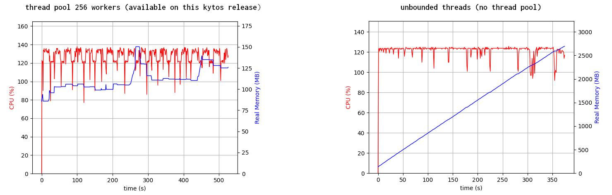
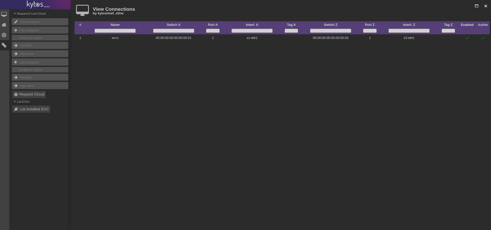
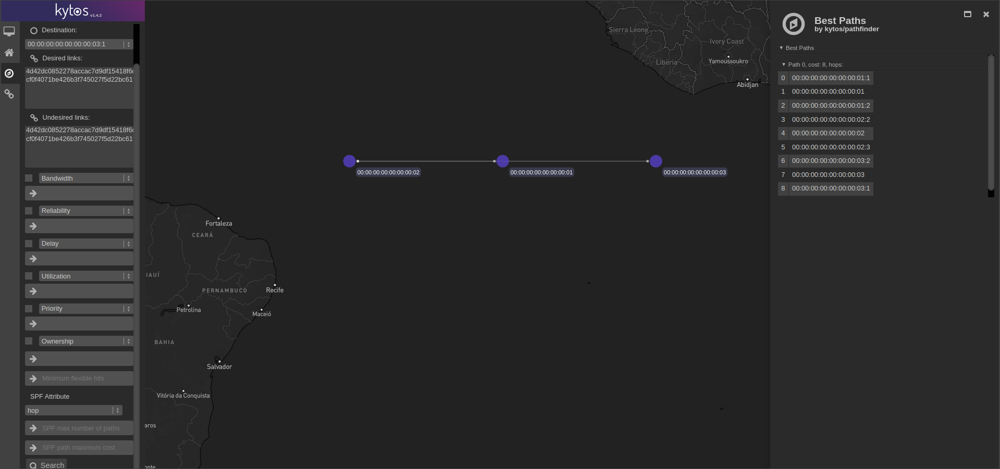

  <h1>Kytos-ng 2022.1 - jovelina</h1>

  

The first Kytos-ng version `2022.1`, jovelina, with multiple NApps was released in February.

## 2022.1 goals

This section provides detailed information about the goals of this version.

### 1. Enhancements and bug fixes on Kytos-ng and NApps

This subsection summarizes major enhancements and fixes that were implemented on Kytos-ng and NApps. For a complete list, please check out the release page and changelog of each NApp that you can find in the [Kytos-ng and NApps released section](#kytos-ng-and-napps-released).

**kytos**:

- Added new `kytos/core.openflow.connection.error` for asynchronous socket connection errors
- Enhanced `NAppsManager.get_napps_from_path` to be deterministic
- Added a new `kytosd` option `--thread_pool_max_workers` to manage memory usage more efficiently on `listen_to` handlers
- Bug fix to support handling protocol connection error
- Concurrency bug fixes

**python-openflow**:

- Added support for experimenter actions

**mef_eline**:

- Bug fixes and new features UI features that are described in subsection 4
- Added new event to allow `available_tags` synchronization on `topology`
- Parametrized `force` option when sending request to `flow_manager` leveraging this new feature
- Concurrency bug fixes

**flow_manager**:

- Consistency check improvements and optimizations, faster indexed lookups, [EP24 blueprint](https://github.com/kytos-ng/kytos/blob/master/docs/blueprints/EP024.rst)
- Added support for OpenFlow 1.3 message types of `OFPT_BARRIER_REQUEST` and `OFPT_BARRIER_REPLY`
- New event to improve overall OpenFlow FlowMod messages and state management, including handling connection errors
- Added support for the `force` option when sending OpenFlow FlowMod messages
- Concurrency bug fixes

**topology**:

- Bug fixes handling port status changes for interfaces and links
- Added feature to store link `available_tags`
- Optimized and minimized events for Link up notifications
- Concurrency bug fixes

**of_core**:

- Fixed `handle_raw_in` to avoid data loss under high usage scenarios
- Implemented support to add a new action class, which enable the use of experimenter action
- Fixed `switch.lastseen` when handling OpenFlow features reply
- Changed `update_port_status` on `OFPPR_DELETE` to deactivate an interface instead of deleting to keep `topology` consistent
- Concurrency bug fixes

**noviflow**:

- Added support to NoviFlow OpenFlow custom experimenter actions to enable INT and BFD

**pathfinder**:

- Added support computing constrained best paths, [EP23-2 blueprint](https://github.com/kytos-ng/kytos/blob/master/docs/blueprints/EP023-2.rst)
- Added Web UI components to be able to search with the new constrained path attributes
- Fixed bug edge case when building the topology graph with admin down interfaces and links
- Added support to update graph based on Link metadata events

### 2. Deploy Kytos-ng and NApps on testing and production-like environments

The following switches have been tested with `kytos` version `2022.1`:

Switch Vendor                        | Switch          | Firmware version        | OpenFlow version | Environment type
-------------------------------------|-----------------|-------------------------|------------------|-----------------
[OVS](https://www.openvswitch.org/)  | ovs-switchd     | 2.15                    | 1.3              | testing
[NoviFlow](https://www.noviflow.com) | WB5132-F        | NW570.2.1 and NW550.2.3 | 1.3              | production 

[kytos-end-to-end-tests](https://github.com/amlight/kytos-end-to-end-tests) suite was only run for OVS in this release. In the future, other switch target platforms might be supported by this test suite.

### 3. Perform network stress terms to verify performance, reliability an overall stability

In order to verify Kytos-ng performance, reliability, and overall stability, we designed a set of experiments considering different scenarios: batch creation of hundreds of L2VPNs (i.e., mef_eline's EVC), Kytos-ng execution in disruptive environments (i.e., considering link disruption, switch connection reset, controller failures), long term Kytos-ng execution. Each experiment was repeated 10 times (except the long-term Kytos-ng execution), and we analyze the results considering the confidence interval of 95%.

Metric                                      |  Kytos-ng 2022.1               | Kytos 2021.1
--------------------------------------------|--------------------------------|---------------------------------------
Reliable L2VPN service                      | 100% (300+-0 EVCs)             | 87% (261 +- 18 EVCs)
Reliable consistency routine                | 0 incorrect executions         | 1869 +- 597 incorrect executions
Reliable switch connection management       | 0 connection lost              | 42 +- 12 connections lost
Performance - Total Time to create 300 EVCs | 41.98 +- 3.24 minutes          | 185.94+-19.09 minutes (see Obs1 below)
Packet loss under link failure event        | 28.58 +- 1.58 % packet loss    | 24.82 +- 9.40 % packet loss
Packet loss under switch connection failure | 0.0 +- 0.0 % packet loss       | 11.16 +- 9.98 % packet loss
Packet loss under controller failure        | 0.0 +- 0.0 % packet loss       | 12.00 +- 10.65 % packet loss

Obs1: We've configured a maximum timeout of 120 seconds for the mef_eline API to create an EVC. That was necessary for the tests against Kytos 2021.1, otherwise, some requests would last more than 48hs with no response. That was happening due to many race conditions and deadlock conditions found and fixed since Kytos 2021.1 release (i.e., all the fixes were included in Kytos-ng 20221. release).

Additionally, Kytos-ng's long-term execution showed no significant CPU overhead or memory consumption. The system remained stable during a 48h continuous execution.

Another performance improvement that was shipped in this release is illustrated in Figure 1, which shows the memory usage over time comparing the current implementation with thread pool and the prior implementation without it, under a stress test scenario generating 700+ events/sec, the new implementation reduced the space complexity from linear to relatively constant.

  

  Figure 1 - Comparison of memory usage with and without thread pool under stress test

### 4. Add more Web UI functionalities for ``mef_eline`` and ``pathfinder``

`mef_eline` and `pathfinder` both had new Web UI features added. `mef_eline` now supports listing EVCs, editing and show individual details as shown in Figure 2, and `pathfinder` now supports finding constrained best paths as illustrated in Figure 3.

  

  Figure 2 - <code>mef_eline</code> Web UI EVCs list

  

  Figure 3 - <code>pathfinder</code> Web UI

### 5. Migrate Kytos-ng to run on Python 3.9 from Python 3.6

`kytos`, `python-openflow`, `kytos-utils` now support Python 3.9, so the project can benefit from the improved performance and overall enhancements that upstream has delivered. Also, this will allow Kytos-ng to leverage new version of existing libraries or any new critical upstream bug fix that might become available. Also, docker files on [kytos-docker](https://github.com/amlight/kytos-docker) are now using `debian:bullseye-slim` as a base image and installing Python 3.9.

### 6. Have a docker production build shipping all AmLight NApps with tags

[kytos-docker](https://github.com/amlight/kytos-docker) provides two docker files, [Dockerfile-prod](https://github.com/amlight/kytos-docker/blob/master/Dockerfile-prod), which is a meant to be used in production, and [Dockerfile](https://github.com/amlight/kytos-docker/blob/master/Dockerfile) for testing. Both of these docker files are shipped with multiple NApps and now they support parametrizing a specific tag or version of each NApp.

### 7. Have a more stable and deterministic way to install Python dependencies

NApps will install their Python dependencies when `python setup.py develop` runs. Also, the dependencies, including transitive ones, are pinned to ensure deterministic installation to ensure more stability.

## Kytos-ng and NApps released

The following Kytos-ng projects and NApps were released in this version, for further detailed information about what was released and what changed please visit the release page of each project that you are interested in knowing more and look for the changelog file.

Project                                                        | Release Web Page
-------------------------------------------------------------- |------------------------------------------------------------------------
[kytos](https://github.com/kytos-ng/kytos)                     | [kytos](https://github.com/kytos-ng/kytos/releases)
[python-openflow](https://github.com/kytos-ng/python-openflow) | [python-openflow](https://github.com/kytos-ng/python-openflow/releases)
[kytos-utils](https://github.com/kytos-ng/kytos-utils)         | [kytos-utils](https://github.com/kytos-ng/python-openflow/releases)
[kytos/storehouse](https://github.com/kytos-ng/storehouse)     | [kytos/storehouse](https://github.com/kytos-ng/storehouse/releases)
[kytos/of_core](https://github.com/kytos-ng/of_core)           | [kytos/of_core](https://github.com/kytos-ng/of_core/releases)
[kytos/flow_manager](https://github.com/kytos-ng/flow_manager) | [kytos/flow_manager](https://github.com/kytos-ng/flow_manager/releases)
[kytos/topology](https://github.com/kytos-ng/topology)         | [kytos/topology](https://github.com/kytos-ng/topology/releases)
[kytos/of_lldp](https://github.com/kytos-ng/of_lldp)           | [kytos/of_lldp](https://github.com/kytos-ng/of_lldp/releases)
[kytos/pathfinder](https://github.com/kytos-ng/pathfinder)     | [kytos/pathfinder](https://github.com/kytos-ng/pathfinder/releases)
[kytos/mef_eline](https://github.com/kytos-ng/mef_eline)       | [kytos/mef_eline](https://github.com/kytos-ng/mef_eline/releases)
[kytos/noviflow](https://github.com/kytos-ng/noviflow)         | [kytos-ng/noviflow](https://github.com/kytos-ng/noviflow/releases)
[amlight/coloring](https://github.com/amlight/coloring)        | [amlight/coloring](https://github.com/amlight/coloring/releases)
[amlight/sdntrace](https://github.com/amlight/sdntrace)        | [amlight/sdntrace](https://github.com/amlight/sdntrace/releases)
[amlight/flow_stats](https://github.com/amlight/flow_stats)    | [amlight/flow_stats](https://github.com/amlight/flow_stats/releases)
[amlight/sdntrace_cp](https://github.com/amlight/sdntrace_cp)  | [amlight/sdntrace_cp](https://github.com/amlight/sdntrace_cp/releases)

## GitHub statistics

Approximately 218 GitHub pull requests were merged and 166 issues were closed during the period of this release, from May 2021 to Feb 2022, in the [kytos-ng](https://github.com/kytos-ng) organization.

## Kytos-ng Team

Core Team: Antonio, Rogerio, Vinicius, Italo, Arturo, and Daniela.

Special Thanks to the Kytos community and FIU VIP Students.
