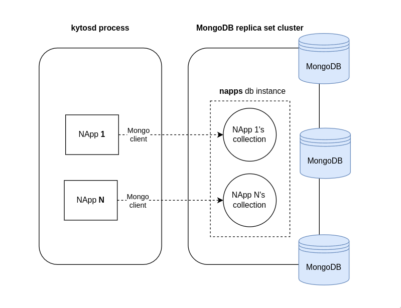
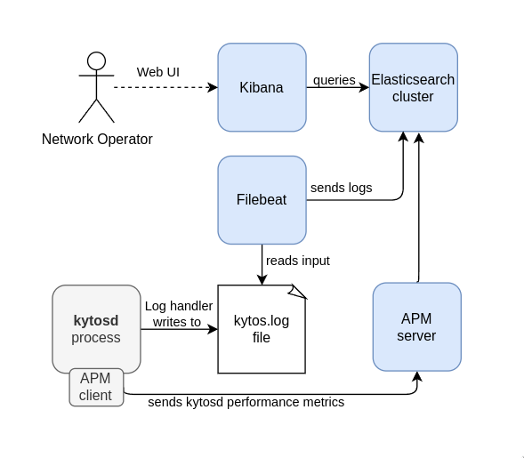
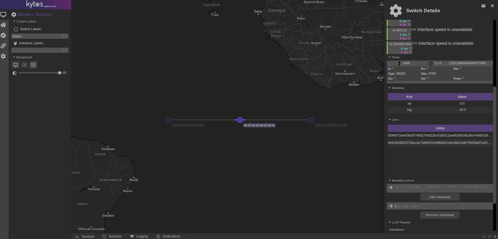
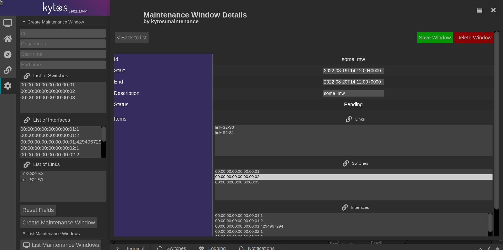

  <h1>Kytos-ng 2022.2 - kiko</h1>

  

Kytos-ng[^1] version `2022.2`, kiko, was released in August.

## Objectives

This version had these major objectives:

- Optimize `mef_eline` EVCs convergence to take place in a few seconds on average.
- Integrate a production-grade recommended document-oriented database for Napps.
- Enhance Kytos-ng to support event message prioritization and have higher performance when handling events in general.
- Have a better infrastructure tools for application performance monitoring (APM) and logging.
- New major features such as link liveness detection, interface loop detection, and new Web UI components.
- Increase unit test coverage to at least 85% on all Kytos-ng NApps (except `flow_stats`, which has a major refactoring coming soon)
- Leverage queue loggers to minimize latency.

In order to achieve the objectives of this version, the following enhancements were refined and delivered:

### 1. `mef_eline` EVCs convergence optimizations

> Protection in Metro Ethernet Networks is a self-healing property of the network that allows it to continue to function with minimal or no impact on the network users upon disruption, outages, or degradation of links, facilities, or equipment. (MEF 2, Technical Specification)

Aligned with MEF Ethernet Service Protection technical specification, `mef_eline` has been enhanced with strategies to provide fast convergence for fully dynamic EVCs, as documented in  [EP029 blueprint](https://github.com/kytos-ng/kytos/blob/master/docs/blueprints/EP029.rst). In particular, we've introduced an improved convergence time when handling link failure events using maximum disjoint path algorithms and pre-installed failover paths.

`mef_eline` convergence performance is more than 100x faster in handling link failure events for hundreds of EVCs compared to the previous release (see complete performance evaluation and details in [PR #175](https://github.com/kytos-ng/mef_eline/pull/175)). In addition, the overall performance achieved a sub-second convergence time (plus control plane latency) for handling a single link failure.

### 2. `mef_eline` QinQ enhancements

QinQ has been reintroduced by setting the customer VLAN on the ingress when pushing the QinQ encapsulation since this action is correctly supported by OvS and NoviFlow switches.
This feature had been removed from `mef_eline` due to the lack of compatibility from Noviflow switches.

### 3. MongoDB core infrastructure and NApps integration

MongoDB has been chosen as the document-oriented database based on the [EP026 blueprint](https://github.com/kytos-ng/kytos/blob/master/docs/blueprints/EP026.rst) requirements for NApps. Kytos-ng has been integrated with `pymongo` driver library exposing a database client for NApps. Figure 1 illustrates the current high level integration between Kytos-ng NApps and MongoDB with a replica set cluster.

  

  Figure 1 - Kytos-ng NApps high level integration with MongoDB

On Kytos-ng documentation, there are more technical information about the current [integration architecture](https://kytos-ng.github.io/napps/mongodb.html) with MongoDB and [general notes](https://kytos-ng.github.io/napps/mongodb_notes.html) for production deployment. On Kytos-ng [readme](https://github.com/kytos-ng/kytos#how-to-use-with-mongodb) page, there are more information about how to run and use MongoDB with Kytos-ng.

`flow_manager`, `mef_eline`, and `topology` have migrated from `storehouse` to MongoDB for higher performance, production and maintainability reasons. Also, since this new database infrastructure is officially supported, `storehouse` has been deprecated. If you were using any of these NApps in your network infrastructure, a migration script is also available in the `scripts/` folder of each NApp repository to migrate the stored data gracefully to leverage the new enhanced implementation and supported infrastructure.

### 4. Kytos-ng core queues improvements and event message prioritization

Kytos-ng core queues `msg_in` and `msg_out` have been improved to support event message prioritization to avoid control plane message starvation from the controller's perspective. All NApps that deal with low level OpenFlow messages and put message in either `msg_out` or `msg_in` queues are responsible to set the message priority accordingly. A [new module](https://github.com/kytos-ng/of_core/blob/master/msg_prios.py) is available on `of_core` to standardize which priority value is supposed to be set.

In addition, Kytos-ng now provides `asyncio` integration for event listeners with a new `alisten_to` decorator, so NApps can benefit from more lightweight handlers. Also, this open doors for future integration with `asyncio` libraries and its ecosystem.

### 5. APM and logging infrastructure core integration

Kytos-ng has been integrated with Elasticsearch [APM Python client](https://github.com/kytos-ng/kytos/blob/master/docs/blueprints/EP027.rst) to have performance and monitoring metrics. This [page](https://github.com/kytos-ng/kytos#how-to-use-with-elastic-apm) documents how to use and enable the APM client with Kytos-ng. Elasticsearch, Filebeat, and Kibana can also be used in order to have a robust, indexed, and searchable logs infrastructure services based on [EP028 blueprint](https://github.com/kytos-ng/kytos/blob/master/docs/blueprints/EP028.rst). Figure 2 illustrates these services integrated with Kytos-ng and a network operator using Kibana Web user interface to either query for logs or application performance metrics.

  

  Figure 2 - Elasticsearch, Kibana, Filebeat and APM integration with Kytos-ng.

### 6. Link liveness detection

`of_lldp` has been extended to provide [link liveness detection](https://github.com/kytos-ng/kytos/blob/master/docs/blueprints/EP030.rst), leveraging the existing LLDP messages, to detect link transport outage that might not necessarily trigger a port down event. Link liveness detection can be enabled per interface and it needs to be enabled on each pair in order to work. This implementation is meant to provide a generic alternative to BFD (Bidirectional Forwarding Detection - RFC 5880) where the protocol states is being tracked by the control plane.

### 7. Interface loop detection

`of_lldp` has also been augmented to detect if an interface of a switch is looped. [Interface loop detection](https://github.com/kytos-ng/kytos/blob/master/docs/blueprints/EP025.rst) is automatically enabled once LLDP since it is been designed to detect unexpected or accidental loops that can happen. This feature has configuration options to configure configure which action should be applied once a loop is detected, by default, it generates a log warning message, but it can also disable an interface. Also, loops can be configured to be ignored.

### 8. New Web UI components

The following Web UI functionalities were added on `topology`:

- Table to display switch metadata.
- Table to display links of a switch including its attributes.
- Form and buttons to add and remove metadata from a switch, a link or an interface.
- Toggle buttons to enable and disable a switch, a link or an interface.
- Form and buttons to enable and disable LLDP on interfaces.

  

  Figure 3 - <code>topology</code> Web UI

These new Web UI features were added on `maintenance`:

- Table to list, edit, and filter maintenance windows.
- Toolbar to create maintenance windows.
- Buttons to finish, extend or delete a maintenance window.

  

  Figure 4 - <code>maintenance</code> Web UI

### 9. Increase unit test coverage to 85% on all Kytos-ng NApps

All Kytos-ng Napps (except flow_stats, which has a major refactoring coming soon) now have at least 85% of unit test coverage. Unit test coverage has been increased on `coloring`, `sdntrace`, and `sdntrace_cp` in this version to achieve this major goal, enhancing overall code quality and future code maintainability.

### 10. Leverage queue loggers to minimize latency

Kytos-ng and NApps now leverage [QueueHandler and QueueListener](https://docs.python.org/3/library/logging.handlers.html#queuehandler) as default loggers in order to minimize latency when log statements are used. On average, this new logger demonstrated to be four times as fast as the default logger and 95th percentile of log statements taking more than 1 ms were reduced to less than 1% in a stress test scenario.

### 11. Move AmLight NApps on kytos-ng organization

[`coloring`](https://github.com/kytos-ng/coloring),[`sdntrace`](https://github.com/kytos-ng/sdntrace), [`sdntrace_cp`](https://github.com/kytos-ng/sdntrace_cp), and [`flow_stats`](https://github.com/kytos-ng/flow_stats) code repositories have been moved from the [amlight](https://github.com/kytos-ng) organization to the [kytos-ng](https://github.com/kytos-ng) organization, this is to unify the NApps that are being maintained by the Kytos-ng core team. GitHub still maintain compatibility with the previous upstream urls, but the new ones should be used from this point forward.

## Kytos-ng and NApps released

The following Kytos-ng projects and NApps were released in this version, for further detailed information about what was released and what changed please visit the release page of each project that you are interested in knowing more and look for the changelog file.

Project                                                        | Release Web Page
-------------------------------------------------------------- |------------------------------------------------------------------------
[kytos](https://github.com/kytos-ng/kytos)                     | [kytos](https://github.com/kytos-ng/kytos/releases)
[python-openflow](https://github.com/kytos-ng/python-openflow) | [python-openflow](https://github.com/kytos-ng/python-openflow/releases)
[kytos-utils](https://github.com/kytos-ng/kytos-utils)         | [kytos-utils](https://github.com/kytos-ng/python-openflow/releases)
[ui](https://github.com/kytos-ng/ui)                           | [ui](https://github.com/kytos-ng/ui/releases)
[kytos/of_core](https://github.com/kytos-ng/of_core)           | [kytos/of_core](https://github.com/kytos-ng/of_core/releases)
[kytos/flow_manager](https://github.com/kytos-ng/flow_manager) | [kytos/flow_manager](https://github.com/kytos-ng/flow_manager/releases)
[kytos/topology](https://github.com/kytos-ng/topology)         | [kytos/topology](https://github.com/kytos-ng/topology/releases)
[kytos/of_lldp](https://github.com/kytos-ng/of_lldp)           | [kytos/of_lldp](https://github.com/kytos-ng/of_lldp/releases)
[kytos/mef_eline](https://github.com/kytos-ng/mef_eline)       | [kytos/mef_eline](https://github.com/kytos-ng/mef_eline/releases)
[kytos/maintenance](https://github.com/kytos-ng/maintenance)   | [kytos-ng/maintenance](https://github.com/kytos-ng/maintenance/releases)
[amlight/coloring](https://github.com/kytos-ng/coloring)       | [kytos-ng/coloring](https://github.com/kytos-ng/coloring/releases)
[amlight/sdntrace](https://github.com/kytos-ng/sdntrace)       | [kytos-ng/sdntrace](https://github.com/kytos-ng/sdntrace/releases)
[amlight/flow_stats](https://github.com/kytos-ng/flow_stats)   | [kytos-ng/flow_stats](https://github.com/kytos-ng/flow_stats/releases)
[amlight/sdntrace_cp](https://github.com/kytos-ng/sdntrace_cp) | [kytos-ng/sdntrace_cp](https://github.com/kytos-ng/sdntrace_cp/releases)

### Switches Compatibility List

The following switches have been tested with Kytos version `2022.2`:

Switch Vendor                        | Switch          | Firmware version        | OpenFlow version | Environment type
-------------------------------------|-----------------|-------------------------|------------------|-----------------
[OVS](https://www.openvswitch.org/)  | ovs-switchd     | 2.15                    | 1.3              | testing
[NoviFlow](https://www.noviflow.com) | WB5132-F        | NW570.2.1 and NW550.2.3 | 1.3              | production 

#### Kytos Testing Dashboard Analytics

An overview about Kytos-ng unit and end-to-end tests coverage is available on these dashboards:

- [Kytos-ng Tests Analytics Scrutinizer](https://kytos-tests.amlight.net/index.html)
- [AmLight Tests Analytics GitLab CI](https://kytos-tests.amlight.net/amlight.html)

### NApps deprecated

- [kytos/storehouse](https://github.com/kytos-ng/storehouse)

## GitHub statistics

In the [kytos-ng](https://github.com/kytos-ng) organization, during the period of this release from February 2022 to August 2022:

- [219 pull requests were merged](https://github.com/search?q=org%3Akytos-ng+is%3Apr+is%3Aclosed+merged%3A2022-02-11..2022-08-22&type=Issues)
- [88 issues were closed](https://github.com/search?q=org%3Akytos-ng+is%3Aissue+label%3A2022.2+closed%3A2022-02-11..2022-08-22&type=Issues)

## Kytos-ng Team

- **Core Team:** Antonio, Rogerio, Vinicius, Italo, David.
- **Contributors (2022.2):** Aldo, Aris, Rohan, Muhammad, Krishna, Gretel.
- **Team Leader:** Jeronimo.

Special Thanks to the Kytos-ng community, and [FIU](https://www.fiu.edu/) VIP[^2] Students.

[^1]: [Kytos-ng](https://github.com/kytos-ng) is supported by the [National Science Foundation (NSF)](https://www.nsf.gov/) AmLight Express and Protect (AmLIght-ExP) (Award # [OAC-2029283](https://nsf.gov/awardsearch/showAward?AWD_ID=2029283&HistoricalAwards=false)) project members [Florida International University](https://www.fiu.edu/) (FIU) and [rednesp](https://www.rednesp.br/) (Research and Education Network at Sao Paulo/Brazil)
[^2]: The Vertically-Integrated Projects (VIP) program aims to involve students on campus in innovation. VIP unites undergraduate education and faculty research in a team-based context.
