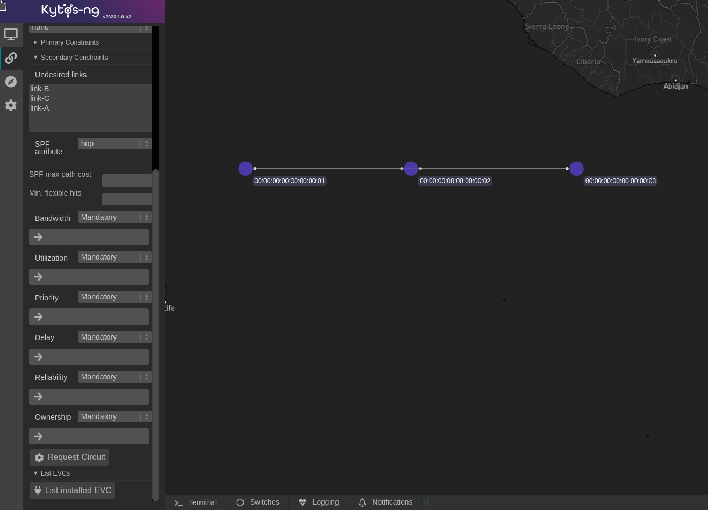

<div align="center">
  <h1>Kytos-ng 2023.1</h1>
  <a href="https://github.com/kytos-ng/"></a>
</div>

<div align="center">
  <a href="https://www.amlight.net"></a>
</div>

Kytos-ng[^1] version `2023.1` was released in July 2023.

## Objectives

This version had these major objectives:


- Augment `mef_eline` to support `"untagged"` and `"any"` VLAN UNIs when provisioning EVCs
- Introduce `of_multi_table` NApp responsible for managing a multi-table OpenFlow pipeline
- Evolve `flow_stats` into `kytos_stats` to support multi-table stats
- Improve and stabilize `maintenance` NApp functionalities
- Migrate `@rest` decorated routes from `werkzeug/flask` to `uvicorn/starlette`
- Stabilize `sdntrace_cp` and general improvements
- General UI fixes and enhancements
- Specify requirements for `mef_eline` VLAN range feature and new Kytos-ng documentation
- General core enhancements and endpoints OpenAPI validations
- Upgrade and simplify core development dependencies

In order to achieve the objectives of this version, the following enhancements were refined and delivered:

### 1. Augment `mef_eline` to support `"untagged"` and `"any"` VLAN UNIs when provisioning EVCs

`mef_eline` now supports provisioning EVCs with `"untagged"` and `"any"` VLAN UNIs. `"untagged"` will match any packet that doesn't have a VLAN header, whereas `"any"` will match any VLAN. `mef_eline` also supports asymmetric VLAN configurations on each UNI. If you need more information about the supported configuration combinations, there's a spreadsheet on [`mef_eline` PR 258](https://github.com/kytos-ng/mef_eline/pull/258) that documents the combinations for both intra and inter EVCs and which OpenFlow matches and actions will be performed.

### 2. Introduce `of_multi_table` NApp responsible for managing a multi-table OpenFlow pipeline

A new NApp [`of_multi_table`](https://github.com/kytos-ng/of_multi_table) has been developed to allow network operators to leverage OpenFlow multi-tables when that's beneficial for their network use case. `of_multi_table` is responsible for managing a multi-table OpenFlow pipeline. This NApp allows you to specify an OpenFlow pipeline composed of multiple tables, where you can also associate which table each NApp of the `kytos-ng` org should be pushing their flows. `of_multi_table` has been integrated with `mef_eline`, `of_lldp`, and `coloring`. Each NApp that pushes flows has a concept of `"table_group"`, which represents a set of flows with similar match criteria that is grouped in a particular table.

### 3. Evolve `flow_stats` into `kytos_stats` to support multi-table stats

In addition to supporting a multi-table OpenFlow pipeline on version `2023.1`, another new NApp [`kytos_stats`](https://github.com/kytos-ng/kytos_stats) has been developed, which is responsible for providing multi-table statistics. `kytos_stats` is a successor of `flow_stats`. It also supports the same functionalities that `flow_stats` supports, except that `flow_stats` route prefixes were renamed. On version `2023.1` you can still use both if you're using `flow_stats` and still need the same API routes. In the future, `flow_stats` will no longer be maintained by Kytos-ng team, so you should plan to migrate to `kytos_stats`.


### 4. Improve and stabilize `maintenance` NApp functionalities

`maintenance` is now capable of generating a logical interruption on all device types (switches, links, and interfaces) properly expressing all affected devices. For more about how logical interruptions work you can check out [blueprint EP037](https://github.com/kytos-ng/kytos/blob/master/docs/blueprints/EP037.rst#ep037---interruption-management). Whenever a maintenance window is scheduled, it'll transitively include associated devices, for instance, if you were to schedule a maintenance window on a switch, it would include all of its links and interfaces. In addition, `maintenance` has enhanced API validations.

### 5. Migrate `@rest` decorated routes from `werkzeug/flask` to `uvicorn/starlette`

Kytos-ng core has replaced `werkzeug/flag` with `uvicorn/starlette` that way enhancing and solving the following problems:

- `werkzeug 2.1.X` is no longer maintaining support to shutdown `werkzeug` server, which was pivotal for Kytos-ng to ensure a graceful shutdown since it's being embedded in the same process.
- Although `flask-socketio` server default threading mode is very reliable and works well out of the box for many use cases, it's vulnerable to threads scalability issues.
- A relatively high-rate of requests, e.g., 500 requests/sec, over 1 minute could lead to overall runtime instability.

`uvicorn/starlette` solves all of these problems while also being optimally designed to be used with `asyncio` and providing a higher capacity to serve requests. If you're upgrading to `2023.1`, the `@rest` decorator is now supposed to take a `request: kytos.core.rest_api.Request` return a `kytos.core.rest_api.JSONResponse` instance, all of the NApps from `kytos-ng` endpoints have been refactored accordingly for `2023.1`, their API specs are still the same.

If you're using a NApp that's not from the `kytos-ng` org and it has `@rest` decorated routes, it needs to be refactored accordingly to be compatible with version `2023.1`. In terms of performance and overall technical requirements, you can find [more information about it on this Kytos-ng GitHub discussion](https://github.com/kytos-ng/kytos/discussions/337). `uvicorn/starlette` also unlocks native Python websockets, which in future versions can expose new types of bidirectional transport. `socket.io` dependency has been removed.

### 6. Stabilize `sdntrace_cp` and general improvements

`sdntrace_cp` is now officially considered stable. All of its API routes are versioned as v1, including supporting OpenAPI validations. Also, `sdntrace_cp` has augmented new states when performing a trace to facilitate understanding an outcome of a trace. In addition, `sdntrace_cp` has removed support to schedule traces to simplify code maintainability.

### 7. General UI fixes and enhancements 

On version `2023.1`, the following UI components were fixed:

- `mef_eline` now supports `primary_constraints` and `secondary_constraints`, including correctly clearing these components
- `ui` no logger supports `socket.io`
- `ui` topology map now displays `metadata.node_name` as a default value when it's defined

<div align="center">
  <a href="assets/mef_eline_ui.png"></a>
</div>
<div align="center">
  Figure 1 - <code>mef_eline</code> Web UI
</div>

### 8. General core enhancements and endpoints OpenAPI validations

Kytos-ng core `GenericEntity` has been augmented to expose `status` and `status_reason`, which as a result is exposed on `topology` too. `status` represents the entity status, and `status_reason` is a set of string values that gives further information about why an entity isn't UP, which also minimizes overuse of `metadata` key value pairs in certain cases.

Kytos-ng core now exposes `@validate_openapi` decorator and an `async` function `avalidate_openapi_request(spec, request)` to validate API endpoints based an OpenAPI specification. On version `2023.1`, the following NApps are now validating their endpoints based on OpenAPI:

- `sdntrace_cp`
- `pathfinder`
- `of_multi_table`
- `mef_eline` (included validations on additional endpoints)

### 9. Specify requirements for `mef_eline` VLAN range feature and consolidated Kytos-ng documentation

On version `2023.1`, Kytos-ng team has initially [specified requirements for supporting a range of VLANs](https://github.com/kytos-ng/kytos/issues/318) on `mef_eline` EVCs. Also, Kytos-ng team has specified [requirements to consolidate Kytos-ng documentation](https://github.com/kytos-ng/kytos/discussions/342), which will simplify and facilitate to onboard new users and contributors. Both of these specifications will be prioritized and implemented in a future release.

### 10. Upgrade and simplify core development dependencies

Kytos-ng now ships these extra runtime dependencies:

- [`httpx`](https://github.com/encode/httpx)
- [`openapi-core`](https://github.com/python-openapi/openapi-core)

Also, Kytos-ng now provides the following development dependencies, that can be installed with `pip3.9 -e git+https://github.com/kytos-ng/kytos.git#egg=kytos[dev]`, allowing NApps to reuse these common development dependencies, which simplifies development requirements updates across all `kytos-ng` repositories:

```
pip-tools >= 2.0
pytest==7.2.1
pytest-cov==4.0.0
pytest-asyncio==0.20.3
black==23.3.0
isort==5.12.0
pylint==2.15.0
pycodestyle==2.10.0
yala==3.2.0
tox==3.28.0
virtualenv==20.21.0
typing-extensions==4.5.0
```

## Database data model changes

- `flow_manager`'s `flows` compound index `switch_1_flow.cookie_1_state_1_inserted_at_1_updated_at_1` has changed. If you're upgrading to `2023.1` from a previous version, you should run the [`drop_compound_index.py` script](https://github.com/kytos-ng/flow_manager/tree/master/scripts#drop-compound-index) to drop it, just so it can be recreated when `flow_manager` loads up again. Also, If you tried to upgrade to `2022.3.2` before and it ended up creating `'flow.priority_1'` index, then you also want to delete it by running `CMD=drop_index INDEX_NAME=flow.priority_1 python3 drop_compound_index.py`.

- `flow_manager`'s `flows` documents have been augmented with two new fields `table_group` and `owner`. If you're upgrading from version `2022.3` and you're going to use `of_multi_table`, then you need to preset these two fields on the `flows` DB collection. In order to do it, you can follow [`these instructions to use the pipeline_related.py`](https://github.com/kytos-ng/flow_manager/tree/master/scripts#add-owner-and-table_group-fields-to-flows-collections) DB script.

- `topology`'s `switches` and `links` collections will no longer store the `active` state and certain links metadata fields. If you're upgrading, it's recommended that you run the [`unset_active.py script`](https://github.com/kytos-ng/topology/tree/master/scripts#-unset-active-from-db-switches-and-links-collections-) to unset the DB fields that will no longer be used. Although, if you don't run this script, an upgrade from `topology` to `2023.1` (with the NApps that it depends on) will still work.

## Kytos-ng and NApps released

The following Kytos-ng projects and NApps were released in this version. For further detailed information about what was released and what changed, please visit the release page of each project you are interested in knowing more about and look for the changelog file.


Project                                                        | Release Web Page
-------------------------------------------------------------- |------------------------------------------------------------------------
[kytos](https://github.com/kytos-ng/kytos)                     | [kytos](https://github.com/kytos-ng/kytos/releases)
[python-openflow](https://github.com/kytos-ng/python-openflow) | [python-openflow](https://github.com/kytos-ng/python-openflow/releases)
[kytos-utils](https://github.com/kytos-ng/kytos-utils)         | [kytos-utils](https://github.com/kytos-ng/kytos-utils/releases)
[ui](https://github.com/kytos-ng/ui)                           | [ui](https://github.com/kytos-ng/ui/releases)
[kytos/of_core](https://github.com/kytos-ng/of_core)           | [kytos/of_core](https://github.com/kytos-ng/of_core/releases)
[kytos/flow_manager](https://github.com/kytos-ng/flow_manager) | [kytos/flow_manager](https://github.com/kytos-ng/flow_manager/releases)
[kytos/topology](https://github.com/kytos-ng/topology)         | [kytos/topology](https://github.com/kytos-ng/topology/releases)
[kytos/of_lldp](https://github.com/kytos-ng/of_lldp)           | [kytos/of_lldp](https://github.com/kytos-ng/of_lldp/releases)
[kytos/pathfinder](https://github.com/kytos-ng/pathfinder)     | [kytos/pathfinder](https://github.com/kytos-ng/pathfinder/releases)
[kytos/maintenance](https://github.com/kytos-ng/maintenance)   | [kytos-ng/maintenance](https://github.com/kytos-ng/maintenance/releases)
[amlight/coloring](https://github.com/kytos-ng/coloring)       | [kytos-ng/coloring](https://github.com/kytos-ng/coloring/releases)
[amlight/sdntrace](https://github.com/kytos-ng/sdntrace)       | [kytos-ng/sdntrace](https://github.com/kytos-ng/sdntrace/releases)
[amlight/sdntrace_cp](https://github.com/kytos-ng/sdntrace_cp) | [kytos-ng/sdntrace_cp](https://github.com/kytos-ng/sdntrace_cp/releases)
[amlight/kytos_stats](https://github.com/kytos-ng/kytos_stats) | [kytos-ng/flow_stats](https://github.com/kytos-ng/kytos_stats/releases)
[amlight/flow_stats](https://github.com/kytos-ng/flow_stats)   | [kytos-ng/flow_stats](https://github.com/kytos-ng/flow_stats/releases)
[kytos/mef_eline](https://github.com/kytos-ng/mef_eline)       | [kytos/mef_eline](https://github.com/kytos-ng/mef_eline/releases)

### Switches Compatibility List

The following switches have been tested with Kytos version `2023.1`:

Switch Vendor                        | Switch          | Firmware version        | OpenFlow version | Environment type
-------------------------------------|-----------------|-------------------------|------------------|-----------------
[OVS](https://www.openvswitch.org/)  | ovs-switchd     | 2.15                    | 1.3              | testing
[NoviFlow](https://www.noviflow.com) | WB5132-F        | NW570.2.1 and NW550.2.3 | 1.3              | production

#### Kytos Testing Dashboard Analytics

An overview of the Kytos-ng and end-to-end tests coverage is available on these dashboards:

- [Kytos-ng Tests Analytics Scrutinizer](https://kytos-tests.amlight.net/index.html)
- [AmLight Tests Analytics GitLab CI](https://kytos-tests.amlight.net/amlight.html)

## GitHub statistics

In the [kytos-ng](https://github.com/kytos-ng) organization, during the period of this release from February 2023 to July 2023:

- [189 pull requests were merged](https://github.com/search?q=org%3Akytos-ng+is%3Apr+is%3Aclosed+merged%3A2023-02-01..2023-07-03&type=Issues)
- [131 issues were closed](https://github.com/search?q=org%3Akytos-ng+is%3Aissue+is%3Aclosed+closed%3A2023-02-01..2023-07-03+label%3A2023.1&type=issues)

## Kytos-ng Team

- **Core Team:** Vinicius, Italo, David, Gretel, Rogerio, Aldo
- **Team Leader:** Jeronimo

Special Thanks to the Kytos-ng community.

[^1]: [Kytos-ng](https://github.com/kytos-ng) is supported by the [National Science Foundation (NSF)](https://www.nsf.gov/) AmLight Express and Protect (AmLIght-ExP) (Award # [OAC-2029283](https://nsf.gov/awardsearch/showAward?AWD_ID=2029283&HistoricalAwards=false)) project members [Florida International University](https://www.fiu.edu/) (FIU) and [rednesp](https://www.rednesp.br/) (Research and Education Network at Sao Paulo/Brazil)
