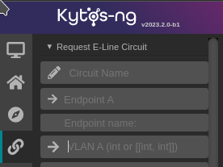
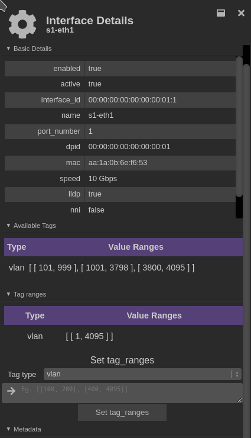
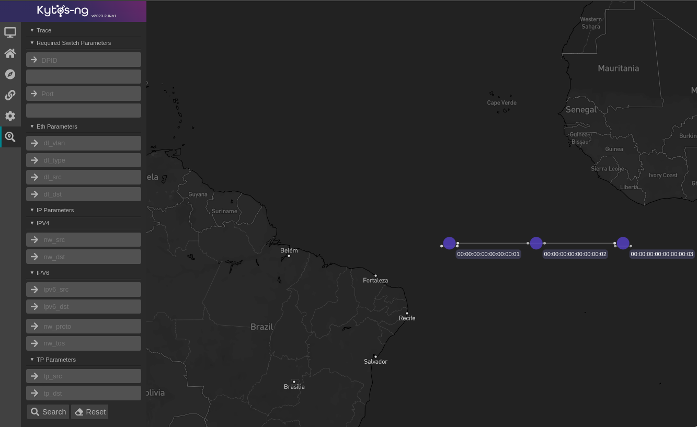
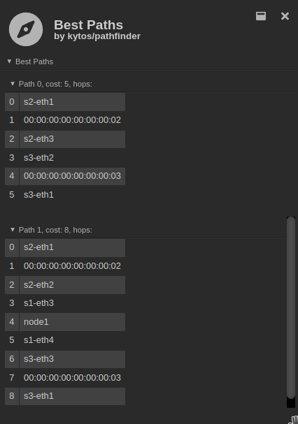

  <h1>Kytos-ng 2023.2</h1>
  

  

Kytos-ng[^1] version `2023.2` was released in February 2024.

## Objectives

This version had these major objectives:

- Augment `mef_eline` to support vlan ranges
- Develop `telemetry_int` NApp
- Augment `pathfinder` filters to be able to exclude metadata `ownership` values
- Allow more granular configuration for event buffers queue size
- `mef_eline` general enhancements
- UI components for `pathfinder`,`sdntrace_cp`, and `mef_eline`
- Migrate core UI and NApps UI to Vue.js 3
- `flow_stats` in favor of `kytos_stats`

### 1. Augment `mef_eline` to support vlan ranges

`mef_eline` EVPL now supports symmetric vlan ranges. This feature enables a set of vlans to be encapsulated in a single EVPL, which also tries to efficiently minimizes the number of flow entries on both ingress and engress switches with vlan masks.

### 2. Develop `telemetry_int` NApp

A new NApp [`telemetry_int`](https://github.com/kytos-ng/telemetry_int) has been developed. This NApp is responsible for enabling In-Band Network Telemetry (INT) on EVCs. On this first iteration, INT can be enabled or disabled on EVCs, when INT is enabled, `telemetry_int` will provision higher priority flows matching TCP and UDP packets. For more information, check out [EP031 blueprint](https://github.com/kytos-ng/kytos/blob/master/docs/blueprints/EP031.rst). On this iteration, `telemetry_int` hasn't implemented network convergence events yet, which will be released in the next version.

### 3. Augment `pathfinder` filters to be able to exclude metadata `ownership` values

`pathfinder` now supports a `not_ownership` filter, which will logically exclude accordingly the given `ownership` values. `mef_eline` has also been augmented to support setting this `not_ownership` filter on both primary and secondary constraints.

### 4. Allow more granular configuration for event buffers queue size

On `kytos.conf` these new options are supported:

- `api_concurrency_limit` for setting the maximum number of concurrent API requests on synchronous `@rest` endpoints before rejecting requests.
- `event_buffer_conf` for setting each `KytosEventBuffer` queue size for fine tuning. Prior to this version, each bounded queue size was derived from the `thread_pool_max_workers` linearly, but now queue sizes can be configured separated from the number of the thread pool workers. By default, each `KytosEventBuffer` queue size will be twice as the size of the number of the thread pool workers of a related thread pool.
- `thread_pool_queue_monitors` and `event_buffer_monitors` are for monitoring high queue usage of thread pools and `KytosEventBuffer`s respectively, by default, queue monitors are enabled and they will start logging a warning if any of the monitored queues are with 100% utilization over a time window of 5 seconds, which are configurable. Queue monitors coupled with APM can provide enhanced visibility for detecting queueing overload.

If upgrading from prior Kytos-ng versions, one might want to regenerate `kytos.conf` file to have all the default values explicitly set.

### 5. `mef_eline` general enhancements

The following significant enhancements and fixes have been shipped on this version:

- The `active` state now persists in the database, this has simplified EVCs activations that used to happen during `kytosd` restart.
- The disjoint algorithm now also excludes sharing switches when selecting the `failover_path`.
- Fixed race condition on `failover_path` when handling simultaneous link down events.
- EVC `active` status now include UNIs status.
- Fixed validation when trying to reusing the same UNI vlan when updating an EVC.

### 6. UI components for `pathfinder`,`sdntrace_cp`, and `mef_eline`

`mef_eline` vlan ranges `[[int, int]]` is also avaiable in the UI:

  

  Figure 1 - <code>mef_eline</code> Web UI

Also, in the core interface component one can find information about the current ranges of vlans and which ranges are still available to use:

  

  Figure 2 - Interface tag ranges Web UI

`sdntrace_cp` has new UI components supporting the current v1 API:

  

  Figure 3 - <code>sdntrace_cp</code> Web UI

`pathfinder` now also interpolates certain reserved metadata values:

  

  Figure 3 - <code>pathfinder_ui</code> Web UI

### 7. Migrate core UI and NApps UI to Vue.js 3

A new effort to migrate core UI to Vue.js 3 has been started, most major blockers have been addressed. In a next version, the migration to Vue 3 will be executed.

### 8. `flow_stats` in favor of `kytos_stats`

[`flow_stats`](https://github.com/kytos-ng/flow_stats) NApp has been deprecated in favor of [kytos_stats](https://github.com/kytos-ng/kytos_stats). `kytos_stats` is `flow_stats`'s successor, all `flow_stats` functionalities are still available and exposed on API endpoints but with a different route prefix, check out the [API docs](https://kytos-ng.github.io/api/kytos_stats.html) for more information.

## Database data model changes

If upgrading from `2023.1` the follow mandatory scripts need to be executed. In the `scripts` folder there's a `README.md` file with more information about each script:

[`topology` mandatory scripts](https://github.com/kytos-ng/topology/tree/master/scripts) for the `interface_details` collection:

- `scripts/vlan_pool.py` to update `available_tags` and set `tag_ranges`.
- `scripts/special_vlan_allocation.py` to set `special_available_tags` and `special_tags`.

[`mef_eline` mandatory scripts](https://github.com/kytos-ng/mef_eline/tree/master/scripts) for the `evcs` collection:

- `scripts/vlan_type_string.py` to update `tag_type` from integer to string.

`mef_eline` optional scripts:

- `scripts/redeploy_evpls_same_vlans.py` can be used to redeploy symmetric (same UNI vlans) EVPLs. `set_vlan` action is only set if UNI A vlan and UNI Z vlan are different now.

## Kytos-ng and NApps released

The following Kytos-ng projects and NApps were released in this version. For further detailed information about what was released and what changed, please visit the release page of each project and look for the `CHANGELOG.rst` file.

Project                                                             | Release Web Page
------------------------------------------------------------------- |------------------------------------------------------------------------
[kytos](https://github.com/kytos-ng/kytos)                          | [kytos](https://github.com/kytos-ng/kytos/releases)
[python-openflow](https://github.com/kytos-ng/python-openflow)      | [python-openflow](https://github.com/kytos-ng/python-openflow/releases)
[kytos-utils](https://github.com/kytos-ng/kytos-utils)              | [kytos-utils](https://github.com/kytos-ng/kytos-utils/releases)
[ui](https://github.com/kytos-ng/ui)                                | [ui](https://github.com/kytos-ng/ui/releases)
[kytos/of_core](https://github.com/kytos-ng/of_core)                | [kytos/of_core](https://github.com/kytos-ng/of_core/releases)
[kytos/flow_manager](https://github.com/kytos-ng/flow_manager)      | [kytos/flow_manager](https://github.com/kytos-ng/flow_manager/releases)
[kytos/topology](https://github.com/kytos-ng/topology)              | [kytos/topology](https://github.com/kytos-ng/topology/releases)
[kytos/of_lldp](https://github.com/kytos-ng/of_lldp)                | [kytos/of_lldp](https://github.com/kytos-ng/of_lldp/releases)
[kytos/pathfinder](https://github.com/kytos-ng/pathfinder)          | [kytos/pathfinder](https://github.com/kytos-ng/pathfinder/releases)
[amlight/coloring](https://github.com/kytos-ng/coloring)            | [kytos-ng/coloring](https://github.com/kytos-ng/coloring/releases)
[amlight/sdntrace_cp](https://github.com/kytos-ng/sdntrace_cp)      | [kytos-ng/sdntrace_cp](https://github.com/kytos-ng/sdntrace_cp/releases)
[kytos/mef_eline](https://github.com/kytos-ng/mef_eline)            | [kytos/mef_eline](https://github.com/kytos-ng/mef_eline/releases)
[kytos/of_multi_table](https://github.com/kytos-ng/of_multi_table)  | [kytos/of_multi_table](https://github.com/kytos-ng/of_multi_table/releases)
[kytos/telemetry_int](https://github.com/kytos-ng/telemetry_int)    | [kytos/telemetry_int](https://github.com/kytos-ng/telemetry_int/releases)
[kytos/maintenance](https://github.com/kytos-ng/maintenance)        | [kytos/maintenance](https://github.com/kytos-ng/maintenance/releases)

### Switches Compatibility List

The following switches have been tested with Kytos version `2023.2`:

Switch Vendor                        | Switch          | Firmware version        | OpenFlow version | Environment type
-------------------------------------|-----------------|-------------------------|------------------|-----------------
[OVS](https://www.openvswitch.org/)  | ovs-switchd     | 2.15                    | 1.3              | testing
[NoviFlow](https://www.noviflow.com) | WB5132-F        | NW570.2.1 and NW550.2.3 | 1.3              | production

#### Kytos Testing Dashboard Analytics

An overview of the Kytos-ng and end-to-end tests coverage is available on these dashboards:

- [Kytos-ng Tests Analytics Scrutinizer](https://kytos-tests.amlight.net/index.html)
- [AmLight Tests Analytics GitLab CI](https://kytos-tests.amlight.net/amlight.html)

Unit test code coverage has increased to at least 90% on most NApps.

## GitHub statistics

In the [kytos-ng](https://github.com/kytos-ng) organization, during the period of this release from August 2023 to February 2024:

- [168 pull requests were merged](https://github.com/search?q=org%3Akytos-ng+is%3Apr+is%3Aclosed+merged%3A2023-08-01..2024-03-14&type=Issues)
- [116 issues were closed](https://github.com/search?q=org%3Akytos-ng+is%3Aissue+is%3Aclosed+closed%3A2023-08-01..2024-03-14+label%3A2023.2&type=issues)

## Kytos-ng Team

- **Core Team:** Vinicius, Italo, David, Rogerio, Aldo
- **Contributors (2023.2):** Gretel, Heriberto Luna, Noel Ngu
- **Team Leader:** Jeronimo

Special Thanks to the Kytos-ng community.

[^1]: [Kytos-ng](https://github.com/kytos-ng) is supported by the [National Science Foundation (NSF)](https://www.nsf.gov/) AmLight Express and Protect (AmLIght-ExP) (Award # [OAC-2029283](https://nsf.gov/awardsearch/showAward?AWD_ID=2029283&HistoricalAwards=false)) project members [Florida International University](https://www.fiu.edu/) (FIU) and [rednesp](https://www.rednesp.br/) (Research and Education Network at Sao Paulo/Brazil)
