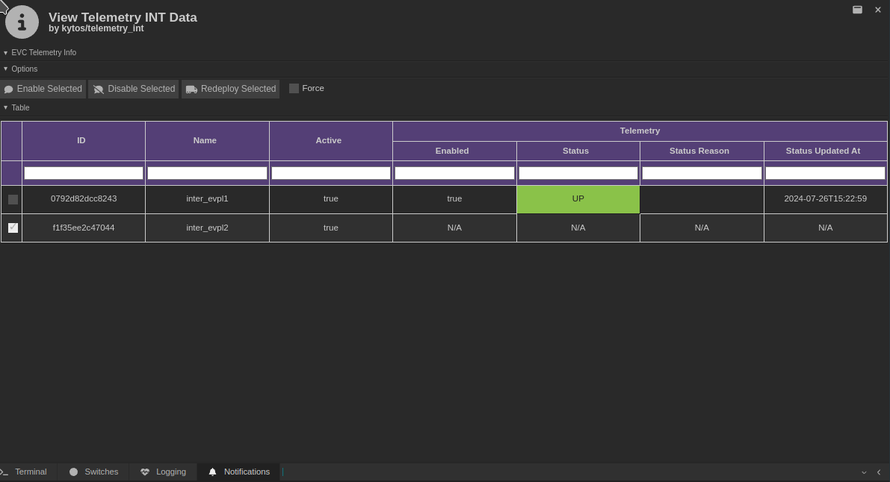
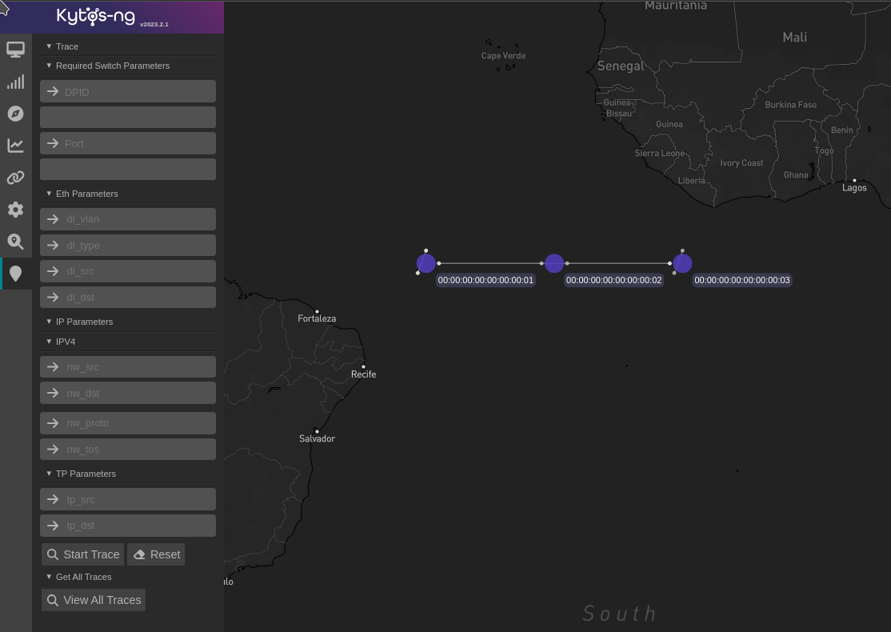
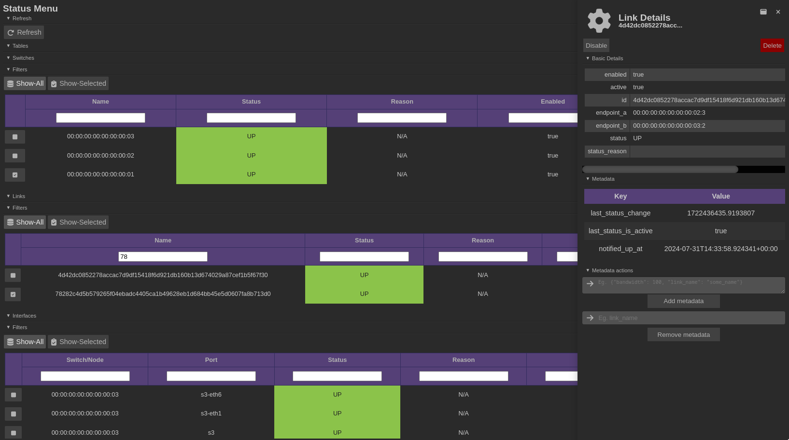

  <h1>Kytos-ng 2024.1</h1>
  

  

Kytos-ng[^1] version `2024.1` was released in August 2024.

## Objectives

This version had these major objectives:

- Develop `telemetry_int` v1 NApp
- Upgrade core UI and NApps UI to Vue.js 3
- Augment `sdntrace` to trace TCP and UDP payloads
- Develop a UI for `sdntrace`
- Introduce pacing functionality on Kytos-ng core
- Develop status menu UI panel to display and filter status data
- Upgrade MongoDB to 7.0
- Upgrade Python to 3.11
- Tune default value for the `api` thread pool size and its concurrency limit

### 1. Develop `telemetry_int` v1 NApp

[`telemetry_int`](https://github.com/kytos-ng/telemetry_int) v1 NApp has been released. This NApp is responsible for enabling In-Band Network Telemetry (INT) on `mef_eline` EVCs. On this version, INT can be enabled or disabled on EVCs, when INT is enabled, `telemetry_int` will provision higher priority flows matching IPv4 TCP and UDP packets. This NApp now supports all network convergence events that `mef_eline` supports. Currently, `telemetry_int` requires an exclusive proxy port (looped) interface per UNI. This NApp also has a UI exposing these functionalities, including providing support to configure `proxy_port` metadata on UNIs:

  

  Figure 1 - <code>telemetry_int</code> UI

### 2. Upgrade core UI and NApps UI to Vue.js 3

Kytos-ng core infrastructure UI and NApps UI have been upgraded to Vue.js 3 in compatibility mode (with the `@vue/compat` package). Improvements have also been made for the production build to have more informative and detailed messages. This upgrade has been a pivotal due to Vue 2 reaching EOL (end of life) date support.

### 3. Augment `sdntrace` to trace TCP and UDP payloads

`sdntrace` has been augmented to to support TCP and UDP payloads, and its API routes has been versioned to v1.

### 4. Develop a UI for `sdntrace`

`sdntrace` now has a UI:

  

  Figure 2 - <code>sdntrace</code> UI

### 5. Introduce pacing functionality on Kytos-ng core

Kytos-ng core now provides pacing (soft rate limiting) functionality, which NApp developers can use to pace certain operations. Currently, the available pacing strategies are `fixed_window` and `ignore_pace`. This new functionality has replaced the batched waited flow mods requests that certain NApps used to have on each NApp, now, it is paced on `flow_manager` and the configuration is available on `flow_manager`'s `settings.py` file. The configuration on `flow_manager` exposes a particular strategy and rate limit per flow owner per dpid.

### 6. Develop status menu UI panel to display and filter status data

A new UI panel that unifies switches, links and interfaces status has been develop. Its main purpose is to provide an easy to use view for network operators to quickly view and filter any of these network entities and their attributes value. For instance, one can use it to find out which links are `DOWN`. The rows of the table on this UI panel are clickable, which can display additional details of the chosen network entity.

  

  Figure 3 - Status Menu UI

### 7. Upgrade MongoDB to 7.0

Kytos-ng MongoDB has been upgraded to support version 7.0, which is the main version that will be tested and supported for production usage. It can still work with lower versions 6.0 and 5.0 but they are not guaranteed to work flawlessly. To upgrade MongoDB to version 7.0, [follow the recommended migration steps documented on this PR](https://github.com/kytos-ng/kytos/pull/470).

### 8. Upgrade Python to 3.11

Kytos-ng and NApps have been upgraded to use Python 3.11 as the supported version.

### 9. Tune default value for the `api` thread pool size and concurrency limit

The `api_concurrency_limit` on `kytos.conf` which defaults to the same value as the `api` thread pool size on `thread_pool_max_workers`, now has a higher default value `512`. If you are upgrading from prior versions, it is recommended that you regenerate `kytos.conf` again or just set the individual new valuable. If either of these values are too low for the scalability of network resources that one is using, log warning messages will be emitted. For more information about how to tune, check out this [issue discussion on GitHub](https://github.com/kytos-ng/kytos/issues/489#issuecomment-2289932188).

## Database data model changes

If upgrading from prior versions, the follow mandatory scripts need to be executed. In the [`scripts/db/2024.1.0` folder](https://github.com/kytos-ng/flow_manager/tree/master/scripts/db/2024.1.0) there's a [README](https://github.com/kytos-ng/flow_manager/blob/master/scripts/db/2024.1.0/README.md) file with more information about each script:

[`flow_manager` mandatory scripts](https://github.com/kytos-ng/flow_manager/tree/master/scripts/db/2024.1.0) for the `flows` collection:

- [`000_hard_delete_old.py`](https://github.com/kytos-ng/flow_manager/blob/master/scripts/db/2024.1.0/000_hard_delete_old.py) can be used for hard deleting old soft deleted flows. It is recommended that you run this script at least one, and ideally on a weekly basis until `flow_manager` provides a feature to have this automatic clean up of old soft deleted flows.
- [`001_update_match_id.py`](https://github.com/kytos-ng/flow_manager/blob/master/scripts/db/2024.1.0/001_update_match_id.py) updates the `match_id` of the flows document which is the `id` value of the documents on this collection, there was a bug fix that changed how the `match_id` is computed for each flow, so this script will update them all accordingly. Before running this script, it is recommended that you run the [`000_hard_delete_old.py`](https://github.com/kytos-ng/flow_manager/blob/master/scripts/db/2024.1.0/000_hard_delete_old.py) script.

## Kytos-ng and NApps released

The following Kytos-ng projects and NApps were released in this version. For further detailed information about what was released and what changed, please visit the release page of each project and look for the `CHANGELOG.rst` file.

Project                                                             | Release Web Page
------------------------------------------------------------------- |------------------------------------------------------------------------
[kytos](https://github.com/kytos-ng/kytos)                          | [kytos](https://github.com/kytos-ng/kytos/releases)
[python-openflow](https://github.com/kytos-ng/python-openflow)      | [python-openflow](https://github.com/kytos-ng/python-openflow/releases)
[kytos-utils](https://github.com/kytos-ng/kytos-utils)              | [kytos-utils](https://github.com/kytos-ng/kytos-utils/releases)
[ui](https://github.com/kytos-ng/ui)                                | [ui](https://github.com/kytos-ng/ui/releases)
[kytos/of_core](https://github.com/kytos-ng/of_core)                | [kytos/of_core](https://github.com/kytos-ng/of_core/releases)
[kytos/flow_manager](https://github.com/kytos-ng/flow_manager)      | [kytos/flow_manager](https://github.com/kytos-ng/flow_manager/releases)
[kytos/topology](https://github.com/kytos-ng/topology)              | [kytos/topology](https://github.com/kytos-ng/topology/releases)
[kytos/of_lldp](https://github.com/kytos-ng/of_lldp)                | [kytos/of_lldp](https://github.com/kytos-ng/of_lldp/releases)
[kytos/pathfinder](https://github.com/kytos-ng/pathfinder)          | [kytos/pathfinder](https://github.com/kytos-ng/pathfinder/releases)
[amlight/coloring](https://github.com/kytos-ng/coloring)            | [kytos-ng/coloring](https://github.com/kytos-ng/coloring/releases)
[amlight/sdntrace_cp](https://github.com/kytos-ng/sdntrace_cp)      | [kytos-ng/sdntrace_cp](https://github.com/kytos-ng/sdntrace_cp/releases)
[kytos/mef_eline](https://github.com/kytos-ng/mef_eline)            | [kytos/mef_eline](https://github.com/kytos-ng/mef_eline/releases)
[kytos/of_multi_table](https://github.com/kytos-ng/of_multi_table)  | [kytos/of_multi_table](https://github.com/kytos-ng/of_multi_table/releases)
[kytos/telemetry_int](https://github.com/kytos-ng/telemetry_int)    | [kytos/telemetry_int](https://github.com/kytos-ng/telemetry_int/releases)
[kytos/maintenance](https://github.com/kytos-ng/maintenance)        | [kytos/maintenance](https://github.com/kytos-ng/maintenance/releases)
[amlight/kytos_stats](https://github.com/kytos-ng/kytos_stats)      | [kytos-ng/kytos_stats](https://github.com/kytos-ng/kytos_stats/releases)
[kytos/noviflow](https://github.com/kytos-ng/noviflow)         | [kytos-ng/noviflow](https://github.com/kytos-ng/noviflow/releases)

### Switches Compatibility List

The following switches have been tested with Kytos version `2024.1`:

Switch Vendor                        | Switch          | Firmware version        | OpenFlow version | Environment type
-------------------------------------|-----------------|-------------------------|------------------|-----------------
[OVS](https://www.openvswitch.org/)  | ovs-switchd     | 2.15                    | 1.3              | testing
[NoviFlow](https://www.noviflow.com) | WB5132-F        | NW570.2.1 and NW550.2.3 | 1.3              | testing

#### Kytos Testing Dashboard Analytics

An overview of the Kytos-ng and end-to-end tests coverage is available on these dashboards:

- [Kytos-ng Tests Analytics Scrutinizer](https://kytos-tests.amlight.net/index.html)
- [AmLight Tests Analytics GitLab CI](https://kytos-tests.amlight.net/amlight.html)

## GitHub statistics

In the [kytos-ng](https://github.com/kytos-ng) organization, during the period of this release from March 2024 to August 2024:

- [135 pull requests were merged](https://github.com/search?q=org%3Akytos-ng+is%3Apr+is%3Aclosed+merged%3A2024-03-01..2024-08-31&type=Issues)
- [81 issues were closed](https://github.com/search?q=org%3Akytos-ng+is%3Aissue+is%3Aclosed+closed%3A2024-03-01..2024-08-31+label%3A2024.1&type=issues)

## Kytos-ng Team

- **Core Team:** Vinicius, Italo, David, Rogerio, Aldo
- **Contributors (2024.1):** Heriberto Luna, Ruben Cerna, Enrique Alfonso, Pedro Garcia, Christopher Alvarez
- **Team Leader:** Jeronimo

Special Thanks to the Kytos-ng community.

[^1]: [Kytos-ng](https://github.com/kytos-ng) is supported by the [National Science Foundation (NSF)](https://www.nsf.gov/) AmLight Express and Protect (AmLIght-ExP) (Award # [OAC-2029283](https://nsf.gov/awardsearch/showAward?AWD_ID=2029283&HistoricalAwards=false)) project members [Florida International University](https://www.fiu.edu/) (FIU) and [rednesp](https://www.rednesp.br/) (Research and Education Network at Sao Paulo/Brazil)
