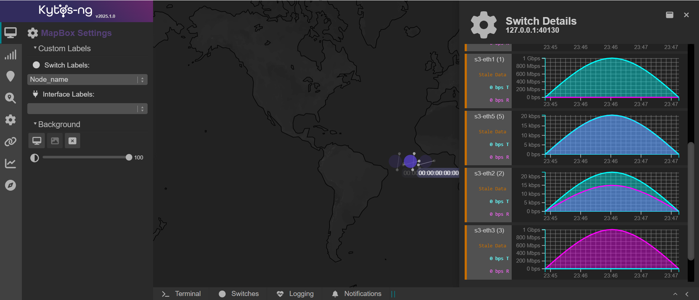

  <h1>Kytos-ng 2025.2</h1>
  

  

Kytos-ng[^1] version `2025.2` was released in Feb 2026.

## Objectives

This version had these major objectives:

- AmLight production sustaining issues fixes
- Change `telemetry_int` proxy ports to be optional for inter-EVCs
- `mef_eline` QinQ is not used anymore when EVCs makes use of VLAN translations
- Add support for virtual NoviFlow switches on e2e tests
- Initial P4 switches support with pyp4ofagent
- Fix `kytos_stats` interface utilization charts
- General UI improvements
- Move Link objects to Kytos-ng core
- End-to-end tests for UI

### 1. Change `telemetry_int` proxy ports to be optional for inter-EVCs

Proxy ports are now optional for inter-EVCs. A proxy port is used if it has `proxy_port` metadata configured on UNIs. Also, when enabling inter-EVCs a new boolean option `proxy_port_enabled` can be set to overwrite whether or not a proxy port should be used for inter-EVCs.

`telemetry_int` now also has a consistency check which will verify if `telemetry_int` flows for a given EVC are installed as expected. `telemetry_int` also exposes consistency check actions to fix these inconsistent flows via a REST endpoint. On version `2025.2`, this consistency check doesn't run automatically yet (it's planned for 2026.1). If you are using `telemetry_int` in a production environment, it's highly recommended to have a periodic script making request to this consistency check endpoint.

### 2. `mef_eline` QinQ is not used anymore when EVCs makes use of VLAN translations

QinQ encapsulation is no longer used for EVCs where VLAN translation takes place (numeric VLAN to untagged and different numeric VLANs), resulting in fewer stacked OpenFlow actions, which ultimately helps to avoid switch pipeline recirculation that can hinder data plane throughput. Also, vlan translation now happens on the egress switch instead of the ingress switch.

### 3. Add suport for virtual NoviFlow switches on e2e tests

Kytos-ng e2e test suites, composed of hundreds of test cases, now also support virtual NoviFlow switches in addition to OvS. A mininet switch wrapper has been developed to interface with virtual NoviFlow instance allowing it to be used in a mininet topology by providing a seamless integration compatible with mininet commands and related test assertion commands. For more information check out [this documentation](https://github.com/kytos-ng/kytos-end-to-end-tests/blob/master/misc/README-NoviSwi.md).

### 4. Initial P4 switches support with pyp4ofagent

Kytos-ng team has been researching solutions to support additional southbound protocols. Strategically, at the moment, AmLight has decided to develop a local OpenFlow agent that bridges and exposes a P4 switch for Kytos-ng as a OpenFlow switch. This solution and architecture also open new possibilities to locally implement certain features in the switches, while also minimizing development effort to support P4 switches. This unlocks P4 switches to be used with all the functionality the existing OpenFlow NApps already support. Also, `pyof` (python-openflow) has been fixed to support table features properties and other related serialization and deserialization issues.

### 5. Fix `kytos_stats` interface utilization charts

`kytos_stats` interface utilization charts have been fixed on the switch details panel as shown on Figure 1. If `kytos_stats` is enabled, interface utilization charts will be plotted, the current polling interval is 50 seconds. These charts are meant to provide a quick overview about network traffic utilization on interfaces of a switch.

  

  Figure 1 - <code>kytos_stats</code> interface utilization chart

### 6. General UI improvements

On this version, many NApps improvements were shipped:

- `maintenance` NApp now support advanced filtering, relative start and end date creation, open ended maintenance window, including new modal confirmations.

Also, many general UI improvements were made:

- `pinia` integration in the core for state application management.
- Mapbox settings are now stored on browser local storage.
- Technical debt mitigated by replacing `Ajax` with ``axios``.

### 7. Move Link objects to Kytos-ng core

Topology `Link` objects have been moved to Kytos-ng core controller, which can be accessed by other NApps via ``self.controller.links``. Kytos-ng org NApps have been refactored accordingly, if have NApps which used to use `topology`'s link object references you should refactor your NApp. `topology` REST endpoint didn't break compatibility though.

### 8. End-to-end tests for UI

To continue to improve code quality, Kytos-ng now has [UI end-to-end tests](https://github.com/kytos-ng/kytos-ui-end-to-end-tests). On this version, many core NApp UI have been already covered and the effort will continue in the next versions to improve UI code coverage of the main UI components used by NApps.

## Database data model changes

If upgrading from prior versions, the following mandatory scripts need to be executed. There's a README file with more information about each script:

- [`000_liveness_deleted.py`](https://github.com/kytos-ng/of_lldp/blob/master/scripts/db/2025.2.0/000_liveness_deleted.py) can be used to list and delete old non existent interfaces which had liveness enabled, but hadn't been fully removed from DB documents. If the `list` command didn't return any document then the DB collection doesn't have any left over to be deleted. This script was also provided on version 2025.1.1, so if you've already run it on, you can skip it on version 2025.2.0.
- **TODO** add mef_eline uni vlan pool script.

The following scripts are optional:

- [`001_cc.py`](https://github.com/kytos-ng/telemetry_int/blob/master/scripts/bash/2025.2.0/001_cc.py) can be used to trigger consistency check runs for INT EVCs, on this version, it's recommended that this script is run every few (3-5) minutes if you're using ``telemetry_int`` in production, if the script detects any flow inconsistencies, it's highly likely that an issue has been found. In that case, if you're trying to remediate the problem to avoid having data plane issues, you should run it with the ``--inconsistent_action=fix`` to fix the inconsistent flows. In addition, in this case you should also report an issue upstream to be analyzed.

In addition, the following console scripts helpers can be used on demand (if a tag leak resource is identified) to fix potential missing tag allocations or deallocations, these have been refactored to work with the interface vlan pool changes:

- [001_use_tags.py](https://github.com/kytos-ng/topology/blob/master/scripts/console/2023.2.0/001_use_tags.py)
- [002_recover_vlans.py](https://github.com/kytos-ng/topology/blob/master/scripts/console/2023.2.0/002_recover_vlans.py)

## Kytos-ng and NApps released

The following Kytos-ng projects and NApps were released in this version. For further detailed information about what was released and what changed, please visit the release page of each project and look for the `CHANGELOG.rst` file.

Project                                                             | Release Web Page
------------------------------------------------------------------- |------------------------------------------------------------------------
[kytos](https://github.com/kytos-ng/kytos)                          | [kytos](https://github.com/kytos-ng/kytos/releases)
[python-openflow](https://github.com/kytos-ng/python-openflow)      | [python-openflow](https://github.com/kytos-ng/python-openflow/releases)
[kytos-utils](https://github.com/kytos-ng/kytos-utils)              | [kytos-utils](https://github.com/kytos-ng/kytos-utils/releases)
[ui](https://github.com/kytos-ng/ui)                                | [ui](https://github.com/kytos-ng/ui/releases)
[kytos/of_core](https://github.com/kytos-ng/of_core)                | [kytos/of_core](https://github.com/kytos-ng/of_core/releases)
[kytos/flow_manager](https://github.com/kytos-ng/flow_manager)      | [kytos/flow_manager](https://github.com/kytos-ng/flow_manager/releases)
[kytos/topology](https://github.com/kytos-ng/topology)              | [kytos/topology](https://github.com/kytos-ng/topology/releases)
[kytos/of_lldp](https://github.com/kytos-ng/of_lldp)                | [kytos/of_lldp](https://github.com/kytos-ng/of_lldp/releases)
[kytos/pathfinder](https://github.com/kytos-ng/pathfinder)          | [kytos/pathfinder](https://github.com/kytos-ng/pathfinder/releases)
[amlight/coloring](https://github.com/kytos-ng/coloring)            | [kytos-ng/coloring](https://github.com/kytos-ng/coloring/releases)
[amlight/sdntrace_cp](https://github.com/kytos-ng/sdntrace_cp)      | [kytos-ng/sdntrace_cp](https://github.com/kytos-ng/sdntrace_cp/releases)
[amlight/sdntrace](https://github.com/kytos-ng/sdntrace)            | [kytos-ng/sdntrace](https://github.com/kytos-ng/sdntrace/releases)
[kytos/mef_eline](https://github.com/kytos-ng/mef_eline)            | [kytos/mef_eline](https://github.com/kytos-ng/mef_eline/releases)
[kytos/of_multi_table](https://github.com/kytos-ng/of_multi_table)  | [kytos/of_multi_table](https://github.com/kytos-ng/of_multi_table/releases)
[kytos/telemetry_int](https://github.com/kytos-ng/telemetry_int)    | [kytos/telemetry_int](https://github.com/kytos-ng/telemetry_int/releases)
[kytos/maintenance](https://github.com/kytos-ng/maintenance)        | [kytos/maintenance](https://github.com/kytos-ng/maintenance/releases)
[amlight/kytos_stats](https://github.com/kytos-ng/kytos_stats)      | [kytos-ng/kytos_stats](https://github.com/kytos-ng/kytos_stats/releases)
[kytos/noviflow](https://github.com/kytos-ng/noviflow)              | [kytos-ng/noviflow](https://github.com/kytos-ng/noviflow/releases)

### Switches Compatibility List

The following switches have been tested with Kytos version `2025.1`:

Switch Vendor                        | Switch          | Firmware version        | OpenFlow version | Environment type
-------------------------------------|-----------------|-------------------------|------------------|-----------------
[OVS](https://www.openvswitch.org/)  | ovs-switchd     | 2.15                    | 1.3              | testing
[NoviFlow](https://www.noviflow.com) | WB5132-F        | NW570.8.4               | 1.3              | testing

#### Kytos Testing Dashboard Analytics

An overview of the Kytos-ng and end-to-end tests coverage is available on these dashboards:

- [Kytos-ng Tests Analytics Scrutinizer](https://kytos-tests.amlight.net/index.html)
- [AmLight Tests Analytics GitLab CI](https://kytos-tests.amlight.net/amlight.html)

## GitHub statistics

In the [kytos-ng](https://github.com/kytos-ng) organization, during the period of this release from May 2025 to February 2026:

- [198 pull requests were merged](https://github.com/search?q=org%3Akytos-ng+is%3Apr+is%3Aclosed+merged%3A2025-05-01..2026-02-28&type=pullrequests)
- [76 issues were closed](https://github.com/search?q=org%3Akytos-ng+is%3Aissue+is%3Aclosed+closed%3A2025-05-01..2026-02-28+label%3A2025.2&type=issues)

## Kytos-ng Team

- **Core Team:** Vinicius, Italo, David, Rogerio, Aldo
- **Contributors (2025.2):** Heriberto Luna, Marcos Schwarz, Usman Aziz, Gretel De la Peña
- **Team Leader:** Jeronimo

Special Thanks to the Kytos-ng community.

[^1]: [Kytos-ng](https://github.com/kytos-ng) is supported by the [National Science Foundation (NSF)](https://www.nsf.gov/) AmLight Express and Protect (AmLIght-ExP) (Award # [OAC-2029283](https://nsf.gov/awardsearch/showAward?AWD_ID=2029283&HistoricalAwards=false)) project members [Florida International University](https://www.fiu.edu/) (FIU) and [rednesp](https://www.rednesp.br/) (Research and Education Network at Sao Paulo/Brazil)
